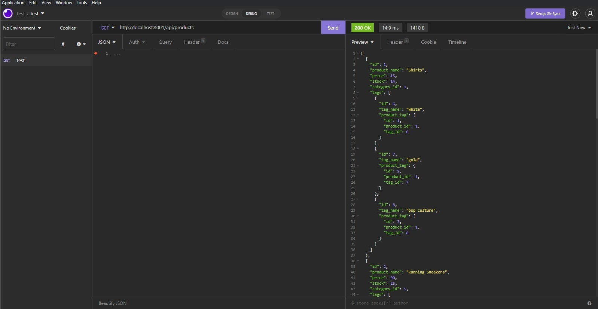

# Retail Store Backend

## Description

You can see, add, update, and remove different products from ecommerce store. To better organize your products you can change each products category and tag that defines them.

## Table of Contents

* [Installation](#installation)
* [Usage](#usage)
* [Contributing](#contributing)
* [Tests](#tests)
* [Questions](#questions)

## Installation

Run 'npm i' on the command line to install all the dependencies needed for this project. Once you create a schema though shell, you can seed the table by running 'npm run seed'.

## Usage

Run 'npm start' to intialize the server and use insomina to make GET, PULL, POST, and DELETE request.

## Contributing

Standard practice for contributing.

## Tests

No tests available at this time.

## Questions

If you have an questions feel free to contact me via [Email](dsapione@gmail.com)
and checkout my other projects on [GitHub](https://github.com/dsapione).
